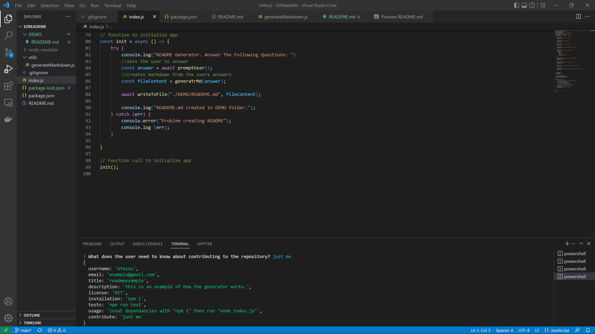
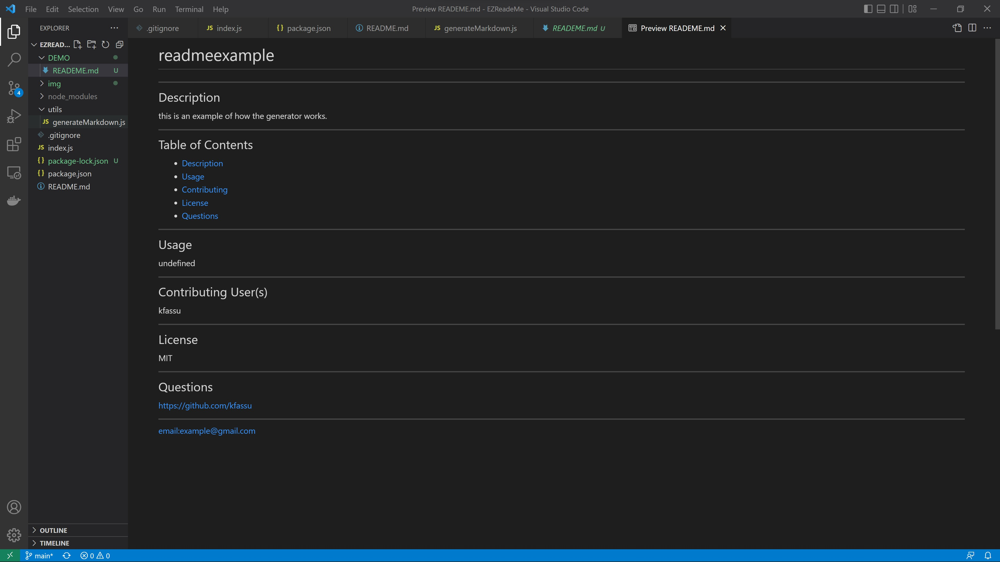

# EZReadeMe

## Description
After working on a long project, sometimes thinking of how and what to put on your ReadMe can be daunting. This generator creates a markdown that can be used in your next repository

## Technology
Node.js
FileSystem
inquirer

## Screenshots

## Demo
[video](https://watch.screencastify.com/v/Fd4iqnGVMQOhbLMV7b65)